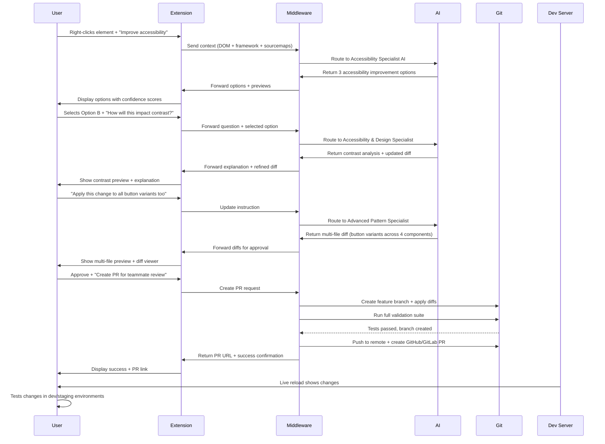

# Ambitious End-State Requirements: AI-Powered UI Editing System

## Version: 2.0 (Vision)
## Target: Production-ready system with full-stack capabilities

---

## 1. Vision Statement

**Goal**: A comprehensive AI-powered development environment that enables non-technical stakeholders to:
- Right-click any UI element or area in a running application
- Describe in natural language what they want to change/improve/add
- Have the AI translate that intent into complete, production-ready code changes across the full stack
- Review and approve changes with precise control
- Commit changes to version control with appropriate messaging
- Deploy changes to staging/production with confidence

The system should feel like "having an expert development team on demand" that understands both the UI context and the codebase architecture.

---

## 2. Full Feature Set (The Complete Vision)

### 2.1 Core UI Interaction

| ID | Feature | Description |
|----|---------|-------------|
| FULL-01 | Universal Right-Click Editing | Works on any element, empty space, or component in any UI framework (React/Vue/Svelte/Angular/etc.) |
| FULL-02 | Alternative Selection Modes | Click-to-select, lasso selection, component hierarchy navigation |
| FULL-03 | Multi-Element Editing | Select and modify multiple elements at once (e.g., "make all these buttons consistent") |
| FULL-04 | Live Element Probing | Hover to see element boundaries, hover zones, margins without clicking |
| FULL-05 | X-Ray Mode | Toggle to see component structure, props, state, event listeners |
| FULL-06 | Design System Integration | Understands and enforces design tokens, breakpoints, themes |
| FULL-07 | Responsive Preview | See how AI suggestions affect all screen sizes (mobile/tablet/desktop) |

### 2.2 Intelligent Code Generation

| ID | Feature | Description |
|----|---------|-------------|
| FULL-10 | Framework-Agnostic Diffs | Generate idiomatic code for React/Vue/Svelte/etc. from the same prompt |
| FULL-11 | Functional Logic Generation | Create event handlers, API calls, state management code, form validation |
| FULL-12 | New Component Creation | Generate complete new components with props, state, styling, tests |
| FULL-13 | Backend Integration | Modify API routes, create services, update database schemas |
| FULL-14 | Test Generation | Create unit tests, integration tests, E2E tests for new functionality |
| FULL-15 | Storybook Integration | Generate Storybook stories for visual regression testing |
| FULL-16 | Documentation Generation | Update code comments, JSDoc, Markdown docs, Swagger/OpenAPI specs |
| FULL-17 | Multi-File Coordination | Orchestrate changes across frontend + backend + database |
| FULL-18 | Architecture-Aware | Understands project architecture (monorepo, microservices, etc.) |
| FULL-19 | Performance Optimization | Analyzes bundle size, rendering performance, suggests improvements |

### 2.3 Human-in-the-Loop Workflow

| ID | Feature | Description |
|----|---------|-------------|
| FULL-20 | Smart Default Options | Without input, suggests common improvements (accessibility, spacing, etc.) |
| FULL-21 | Explanatory Diffs | AI explains what changed and why at each step |
| FULL-22 | Step-by-Step Refinement | Break complex requests into smaller steps for validation |
| FULL-23 | Real-Time Preview | See changes live as you type new instructions/refinements |
| FULL-24 | Interactive Debugging | Ask follow-up questions to clarify intent ("Did you mean this element?") |
| FULL-25 | Confidence Scoring | Show AI confidence level for each suggestion (low/medium/high) |
| FULL-26 | Branch-Based Testing | Create git branches for each change to test independently |
| FULL-27 | Automated Testing | Run project tests after changes, report failures before approval |

### 2.4 Full Stack Integration

| ID | Feature | Description |
|----|---------|-------------|
| FULL-30 | Frontend Framework Support | React, Vue, Svelte, Angular, Solid, Lit, Preact |
| FULL-31 | Backend Detection | Node.js, Python, Go, Ruby, Java, .NET (via language servers) |
| FULL-32 | Database Integration | SQL/NoSQL schema migrations, query optimization |
| FULL-33 | API Gateway Integration | Update routes, middleware, rate limiting, authentication |
| FULL-34 | Cloud/Infrastructure | Generate Terraform/CloudFormation for resource changes |
| FULL-35 | Authentication | Understand auth patterns, update protected routes/components |
| FULL-36 | CI/CD Pipeline Integration | Update build scripts, test commands, deployment workflows |
| FULL-37 | Feature Flags | Integrate with LaunchDarkly/Flagsmith, wrap changes in flags |

### 2.5 Collaboration & Team Features

| ID | Feature | Description |
|----|---------|-------------|
| FULL-40 | Change Approval Workflow | PR-style approval process for teams with reviews, comments |
| FULL-41 | Role-Based Access | Limit features by role (designer vs. developer vs. PM) |
| FULL-42 | Shared Sessions | Real-time collaborative editing (like Figma) |
| FULL-43 | Change History | Visual timeline of all edits, roll back to any point |
| FULL-44 | Export/Import | Save/load edit sessions, share between team members |
| FULL-45 | Commenting | Add comments to specific changes or elements |
| FULL-46 | Integration with Project Tools | Jira, Linear, Trello, Notion - link changes to tickets |
| FULL-47 | Slack/Teams Integration | Notify team of changes, get approvals via chat |

### 2.6 Deployment & Production

| ID | Feature | Description |
|----|---------|-------------|
| FULL-50 | Staging Deployment | One-click deploy AI-generated changes to staging |
| FULL-51 | A/B Testing | Create A/B test variants of UI changes without manual code |
| FULL-52 | Feature Rollouts | Canary releases, percentage-based rollouts |
| FULL-53 | Monitoring Integration | Generate monitoring code (Sentry, Datadog, etc.) for new features |
| FULL-54 | Rollback Capability | Instant rollback of deployed changes with one click |
| FULL-55 | Performance Tracking | Track performance impact of UI changes (Core Web Vitals) |

### 2.7 Advanced AI Capabilities

| ID | Feature | Description |
|----|---------|-------------|
| FULL-60 | Autonomous Improvement Mode | Periodically suggest improvements without user initiation |
| FULL-61 | Design System Maintenance | Detect and fix design system inconsistencies across the app |
| FULL-62 | Technical Debt Reduction | Identify and suggest refactoring opportunities |
| FULL-63 | Local LLM Mode | Full offline support with local LLMs (Llama 3.3 70B+) |
| FULL-64 | Vision Model Integration | Upload screenshots/designs, AI implements them in the codebase |
| FULL-65 | Voice Editing | Voice commands for hands-free editing ("Hey Opencode, make this blue") |
| FULL-66 | Multi-Modal Workflow | Combine voice, screenshot markup, and text for complex changes |
| FULL-67 | Custom Skill System | Train/import custom skills for domain-specific patterns |
| FULL-68 | Prompt Library | Community-contributed prompt templates for common patterns |
| FULL-69 | AI Pair Programming | Real-time AI collaboration during coding sessions |

### 2.8 Security & Compliance

| ID | Feature | Description |
|----|---------|-------------|
| FULL-70 | Security Scanning | Scan generated code for vulnerabilities before applying |
| FULL-71 | Penetration Testing | AI suggests security improvements during editing sessions |
| FULL-72 | Compliance Checking | Ensure changes comply with WCAG, GDPR, HIPAA (configurable) |
| FULL-73 | Secret Detection | Prevent committing secrets in generated code/configs |
| FULL-74 | Audit Logging | Complete log of all changes for security audits |
| FULL-75 | Granular Permissions | Fine-grained access control for sensitive changes |

### 2.9 Ecosystem Integration

| ID | Feature | Description |
|----|---------|-------------|
| FULL-80 | Plugin Marketplace | Extend functionality with plugins (e.g., Shopify, WordPress) |
| FULL-81 | Custom Component Libraries | Support Storybook, Bit.dev, custom component registries |
| FULL-82 | AI Model Selection | Choose between Opencode, Claude, Gemini, local LLMs for different tasks |
| FULL-83 | Integration with IDEs | VSCode, WebStorm, Vim, Emacs integration for enhanced workflow |
| FULL-84 | Browser Extension API | Allow other extensions to hook into the editing system |
| FULL-85 | API for External Tools | Open API for custom integrations (CI/CD, monitoring, etc.) |
| FULL-86 | CLI Companion | Companion CLI tool for headless operation (CI/CD pipelines) |

---

## 3. Technical Architecture (Full Vision)

```
┌───────────────────────────────────────────────────────────────────────────────┐
│                                USER INTERFACE                                │
│  ┌───────────┐    ┌─────────────────┐    ┌───────────────────────────────┐  │
│  │           │    │                 │    │                               │  │
│  │ Browser    │───▶│ Right-click    │───▶│ Annotation & Comment System    │  │
│  │ Extension  │◀───│ Menu           │    │                               │  │
│  │           │    │                 │    └───────────────────────────────┘  │
│  └───────────┘    └──────┬──────────┘                        ▲               │
│                              │                              │               │
└──────────────────────────────┼──────────────────────────────┼───────────────┘
                                 │                              │
                                 ▼                              │
┌───────────────────────────────────────────────────────────────────────────────┐
│                            MIDDLEWARE LAYER                                  │
│  ┌───────────────────────────────┐    ┌───────────────────────────────────┐  │
│  │                               │    │                               │  │
│  │  Local Development Server      │    │  AI Orchestration Engine       │  │
│  │  - Node.js/Fastify             │    │  - Manages AI agents          │  │
│  │  - Port 3000                  │    │  - Routes to specialists       │  │
│  │                               │    │  - Handles multi-step workflows│  │
│  └──────────────┬────────────────┘    └──────────────┬─────────────────┘  │
│                     │                                      │                │
│                     ▼                                      ▼                │
│  ┌──────────────────────────┐                  ┌───────────────────────────┐        │
│  │                          │                  │                       │        │
│  │  Code Analysis System     │─────────────────▶│  UI Recommendation    │        │
│  │  - Framework detection    │                  │  Engine               │        │
│  │  - Dependency analysis    │                  │                       │        │
│  └──────────────┬───────────┘                  └───────────┬───────────┘        │
│                     │                                      │                │
│                     │                                      ▼                │
│                     │                          ┌───────────────────────────┐        │
│                     │                          │                       │        │
│                     │                          │  Full-Stack Change    │        │
│                     │                          │  Generator            │        │
│                     │                          │                       │        │
│                     │                          └───────────┬───────────┘        │
│                     ▼                                      ▼                │
│  ┌──────────────────────────┐                  ┌───────────────────────────┐        │
│  │                          │                  │                       │        │
│  │  Project Configuration   │                  │  Backend & DB         │        │
│  │  Analyzer                │                  │  Generator            │        │
│  │                          │                  │                       │        │
│  └──────────────┬───────────┘                  └───────────┬───────────┘        │
│                     │                                      │                │
└─────────────────────┼──────────────────────────────────────┼────────────────────┘
                               │                                      │
                               ▼                                      ▼
┌───────────────────────────────────────────────────────────────────────────────┐
│                                AI BACKEND                                    │
│  ┌─────────────────┐     ┌─────────────────┐     ┌───────────────────────┐  │
│  │                 │     │                 │     │                       │  │
│  │ Opencode SDK    │     │ Claude API      │     │ Local LLMs          │  │
│  │ (Primary)       │     │ (Secondary)      │     │ (Ollama/Llama)     │  │
│  │                 │     │                 │     │                   │  │
│  └─────────────────┘     └─────────────────┘     └───────────────────────┘  │
│                                                                               │
│  ┌─────────────────┐     ┌─────────────────┐     ┌───────────────────────┐  │
│  │                 │     │                 │     │                       │  │
│  │ Vision Models   │     │ Speech-to-Text   │     │ Agent Scaffold     │  │
│  │ (GPT-4 Vision)  │     │ (Whisper)        │     │ Systems            │  │
│  │                 │     │                 │     │                   │  │
│  └─────────────────┘     └─────────────────┘     └───────────────────────┘  │
└───────────────────────────────────────────────────────────────────────────────┘

┌───────────────────────────────────────────────────────────────────────────────┐
│                                DATA LAYER                                    │
│  ┌──────────────┐     ┌──────────────┐     ┌─────────────────┐    ┌─────────┐    │
│  │              │     │              │     │                 │    │         │    │
│  │ Project      │     │ Git        │     │ Database       │    │ Cache  │    │
│  │ Filesystem   │     │ Repository  │     │ (Vector + SQL) │    │         │    │
│  │              │     │              │     │                 │    │         │    │
│  └──────────────┘     └──────────────┘     └─────────────────┘    └─────────┘    │
└───────────────────────────────────────────────────────────────────────────────┘
```

### Core Components Expanded:

1. **Edge Context Capture** (Browser Extension)
   - **DOM Inspector**: Advanced element analysis (slots, shadow DOM, iframes)
   - **Performance Profiler**: Tracks repaints, layout shifts, load times
   - **Network Monitor**: Analyzes API calls, payloads, caching
   - **State Visualizer**: React hooks, Redux, VueX, Svelte stores
   - **Event Trace**: Records user interactions leading to current state

2. **AI Orchestration Engine**
   - **Prompt Router**: Sends to {CSS/UI/Backend/DB} specialist AI agents
   - **Multi-Agent Consensus**: Compares responses from 2-3 models for quality
   - **Memory System**: Maintains project-level chat history
   - **Intent Classifier**: Determines if instruction needs 1 file or 10
   - **Follow-Up Generator**: Creates clarifying questions when needed

3. **Change Execution Pipeline**
   - **Dependency Graph**: Understands how files relate (components → utils → API)
   - **Atomic Change Engine**: Splits complex changes into independent commits
   - **Conflict Resolution**: 3-way merge with semantic understanding
   - **Validation Stack**: Syntax → Lint → Type → Unit → Integration → E2E
   - **Deployment Adapter**: Staging/production deployment with rollback

4. **Learning & Improvement**
   - **Feedback Loop**: Learns from thumbs up/down, edits made, rejects
   - **Pattern Mining**: Detects common change patterns in the codebase
   - **Bias Correction**: Mitigates over-indexing on specific frameworks
   - **Skill Tutor**: Suggests learning materials based on user struggles

---

## 4. User Experience Flow



---

## 5. Multi-Modal Interaction Patterns

| Interaction Mode | Example Use Case | Implementation |
|------------------|-------------------|-----------------|
| **Text** | "Change button color from blue to teal" | Primary mode, text input with context |
| **Voice** | "Hey Code, make the header sticky" | Web Speech API + Whisper transcribe |
| **Screenshot** | Upload edited Figma screenshot | GPT-4 Vision + element mapping |
| **Laser Pointer** | Circle element + sketch changes | Canvas overlay + edge detection |
| **Tactile** | " Make this area 20% taller" | Drag handles on axis constraint |
| **Natural Language + GUI** | "Increase padding to [slider: 24px]" | Hybrid text + slider input |
| **Fuzzy Matching** | "Like that button in ComponentX" | Cross-referencing exemplar components |

---

## 6. AI Agent Specialization

| AI Agent | Responsibilities | Tools & Knowledge |
|----------|-------------------|--------------------|
| **UI Architect** | Layout, responsive design, accessibility | Tailwind, RadixUI, MaterialUI, WCAG2.2 |
| **CSS Designer** | Visual styling, animation, effects | CSS Grid/Flexbox, SASS/LESS, ShadCN |
| **Frontend Engineer** | React/Vue/Svelte/Angular code | Framework APIs, hooks, state management |
| **Backend Engineer** | API design, database, authentication | Fastify/Express, ORMs, JWT/OAuth |
| **System Architect** | Architecture decisions, performance | Design patterns, performance metrics |
| **Test Engineer** | Comprehensive test coverage | Jest/Vitest, Playwright/Cypress, QA principles |
| **Security Auditor** | Vulnerability detection, fixes | OWASP Top 10, security headers, encryption |
| **Accessibility Expert** | WCAG compliance, screen reader support | ARIA semantics, keyboard navigation, color contrast |
| **DevOps Engineer** | CI/CD, deployment, monitoring | GitHub Actions, Docker, AWS/GCP/Azure |
| **Documentation Lead** | Clear, comprehensive docs | JSDoc, Markdown, diagram generation |

> At runtime, the orchestrator assigns the appropriate specialist(s) based on the instruction's intent.

---

## 7. Error Handling & Safety Mechanisms

| Failure Point | Detection | Recovery Strategy |
|---------------|-----------|---------------------|
| AI hallucinates invalid code | Syntax/TSC validation | Try alternative prompt, suggest manual edit |
| Diff doesn't apply cleanly | Git apply --check | Conflict resolution UI, alternative suggestions |
| Source file moved/renamed | Grep/find + AST analysis | Ask user to locate file manually |
| Framework misdetected | Package.json analysis | Framework override in settings, retry generation |
| AI lacks context | Follow-ups, confidence < 70% | Request more details from user, suggest manual route |
| Integration test fails | Vitest/Jest output | Suggest related changes, offer rollback |
| Security vulnerability | ESLint-plugin-security | Block application, suggest alternatives |
| Performance regression | Lighthouse scores drop | Revert, suggest performance-preserving alternatives |
| API rate limits | HTTP 429 responses | Fallback to local LLM, queue requests |

---

## 8. Deployment Models

| Model | Description | Use Cases |
|-------|-------------|-----------|
| **Local Dev Server** | Node.js server runs on user machine | Individual developers, offline work |
| **Cloud-Hosted** | Central server with project agents | Teams, frequent context switching |
| **Hybrid (Edge Federated)** | Serverless functions + local processing | Large teams with privacy requirements |
| **Plugin (IDE/Chrome/Firefox)** | Embedded in existing tools | Development workflow integration |
| **Self-Hosted** | User manages infrastructure | Enterprise, air-gapped environments |
| **Serverless** | FaaS model (AWS Lambda/Azure Functions) | Cost optimization, scalability |

---

## 9. Monetization & Business Model

| Revenue Stream | Implementation | Target Audience |
|----------------|-----------------|------------------|
| **Freemium** | Free for individuals, paid teams | Solo devs → small teams |
| **Subscription** | $20/user/month for teams | Teams of 5-100 developers |
| **Enterprise** | Custom pricing, SSO, audit logs | 100+ developer organizations |
| **Education** | Free tier for students/teachers | Universities, coding bootcamps |
| **Marketplace** | Paid plugins, skills, templates | Power users, agencies |
| **On-Demand** | Pay per AI inference | Freelancers, sporadic users |
| **API Access** | Usage-based pricing for integrations | Other SaaS/tools building on our API |
| **Professional Services** | Custom development & support | Enterprise custom integrations |

---

## 10. Roadmap & Milestones

| Phase | Timeline | Description |
|-------|----------|-------------|
| MVP | Completed | See the "MVP spec of record" appendix in [`TODO.md`](TODO.md) - basic visual editing |
| Alpha | 3-4 months | Limited functional changes, small teams testing |
| Beta | 6-8 months | Full frontend capabilities, beta enterprise customers |
| v1.0 | 12 months | First stable release, cloud hosting available |
| v2.0 | 18-24 months | Full-stack capabilities, IDE integration |

**Milestone Details**:

1. **Alpha** (End of 2026)
   - Add button functionality (API calls, state changes)
   - Create new components
   - Vue/Svelte support
   - Design system awareness (Tailwind Config)
   - GitHub/GitLab integration

2. **Beta** (Early 2027)
   - Backend/API route modifications
   - Database schema updates (simple)
   - Cloud-hosted option
   - Team collaboration features
   - CI/CD pipeline integration
   - Plugin system foundation

3. **v1.0** (Mid 2027)
   - Production deployment features
   - Comprehensive test generation
   - Full documentation support
   - Marketplace for plugins/skills
   - Self-hosted enterprise version
   - Professional support offerings

4. **v2.0** (Late 2027)
   - Autonomous improvement mode
   - Vision model integration (screenshot → code)
   - Voice interface
   - IDE plugins (VSCode, WebStorm)
   - Advanced code analysis & refactoring
   - Monetization infrastructure

---

## 11. Success Metrics (The North Star)

| Metric | Target (v1.0) | Target (v2.0) |
|--------|---------------|---------------|
| Daily Active Users | 5,000 | 50,000 |
| AI-Generated Changes per User/Week | 10 | 50 |
| User Retention Rate (30-day) | 70% | 85% |
| Hours Saved per Developer/Week | 5 | 15 |
| Accuracy (Approved Changes) | 85% | 95% |
| Codebase Coverage | 60% of files | 90% of files |
| DevOps Cycle Time Reduction | 30% | 60% |
| Customer Acquisition Cost | < $100 | < $150 |
| Annual Recurring Revenue | $2M | $20M |

---

## 12. Risks & Challenges (Full Vision)

| Risk | Impact | Mitigation Strategy |
|------|--------|----------------------|
| **AI Accuracy Too Low** | Trust erodes, abandonment | Multi-model consensus, confidence scoring, human review required for low-confidence changes |
| **Framework Compatibility** | Poor adoption of new frameworks | Plugin system, community contributions, framework detection improvements |
| **Security Vulnerabilities** | Data breaches, exposure | Comprehensive security review, sandboxed execution, local-only mode by default |
| **Performance Bottlenecks** | Slow response times | Edge computing, response streaming, local LLMs for common patterns |
| **Codebase Complexity** | Can't handle monorepos/compound apps | Advanced sourcemapping, project analyzer microservices |
| **Vendor Lock-in** | Dependency on specific AI models | Abstraction layer with multiple model providers, local LLM option |
| **Ethical Concerns** | Job displacement fears | Position as productivity tool, emphasize human-in-the-loop workflows |
| **Adoption Resistance** | Developers prefer manual coding | Focus on tedious tasks, show time savings, integrate with existing tools |
| **Legal Liability** | Generated code causes issues | Clear terms of service, liability disclaimers, validation mechanisms |

---

*Document Version: 1.0*  
*Created: 2026-07-02*  
*Status: Vision Document - Living*